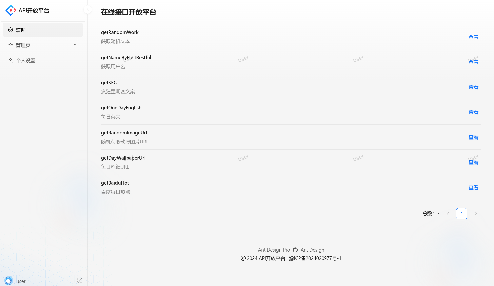
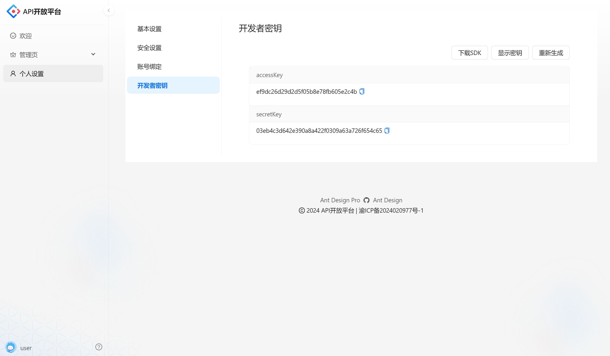

# API开放平台

## 项目介绍

基于 React + Spring Boot + Dubbo + Spring Cloud Gateway 的免费 API 接口开放调用平台。这是一个提供API接口供开发者调用的平台，管理员可以集成并发布接口、下线接口及管理用户等；用户可以注册登录并开通接口调用权限、浏览接口、在线调试，还能使用客户端SDK轻松在代码中调用接口。

在线体验地址：http://api.originai.icu/

## 目录结构

| 目录                                                         | 描述          |
| ------------------------------------------------------------ | ------------- |
| [yiapi-frontend](https://github.com/jieyi123/yiApi/tree/main/yiapi-frontend) | 前端服务模块  |
| [yiapi-backend](https://github.com/jieyi123/yiApi/tree/main/yiapi-backend) | 后端服务模块  |
| [yiapi-common](https://github.com/jieyi123/yiApi/tree/main/yiapi-common) | 公共服务模块  |
| [YiApiGatewayApplication](https://github.com/jieyi123/YiApiGatewayApplication) | 网关模块      |
| [api-interface](https://github.com/jieyi123/yiApi/tree/main/api-interface) | 接口模块      |
| [yiapi-client-sdk](https://github.com/jieyi123/yiApi/tree/main/yiapi-client-sdk) | 开发者调用sdk |

## 架构图

## 技术栈

### 前端

* React18
* Ant Design Pro 5.X脚手架
* Ant Design & Procomponents 组件库
* Umi4前端框架
* OpenAPI前端代码生成
* 数据可视化

### 后端

* Java Spring Boot框架
* MySQL数据库
* MyBatis-Plus及MyBatis X自动生成
* Redis分布式登录
* API签名认证(Http调用)
* Spring Boot Starter(SDK开发)
* Dubbo分布式(RPC、Nacos)
* Spring Cloud Gateway微服务网关
* Swagger+Knife4j接口文档生成
* Hutool、Apache Common Utils、Gson等T具库

## 项目截图

